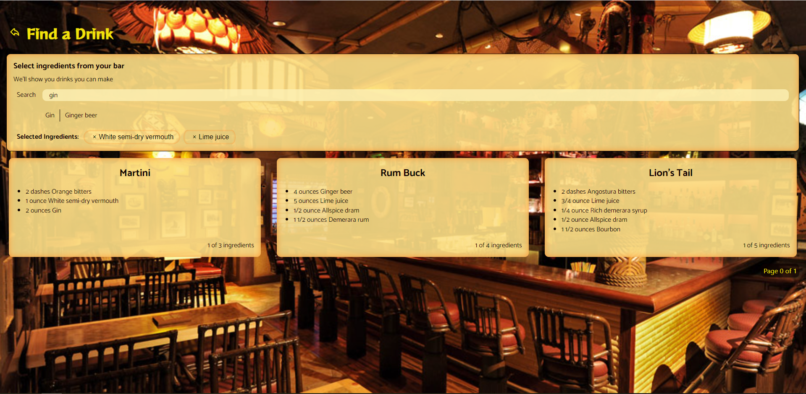

# Barkeep

## Web Client

### Summary

About a year ago, my wife took a deep interest in Tiki and mixology. What we quickly came to learn is that, with all the ingredients that go into a standard Tiki drink, we could go through pages upon pages of recipes before we found one we actually had all the ingredients for.

**Barkeep** is the answer to that.

Barkeep is a drink cataloging app that lets the user:

- Read dozens of drink recipes at a glance
- Search those recipes based on the ingredients on hand
- Add new recipes as they are found

This is 1 of 2 applications needed to run Barkeep. The backend can be found [here](https://github.com/dlars99/barkeep).

### Technical Background

The Barkeep client is built in React with Typescript. It is styled using CSS-in-JS. Additional libraries include Formik and Yup for forms and validation.

Since I built this for my personal use on my personal hardware, security is very lax. Everything is operated in a single-user environment.

I do not consider myself a designer. My main goal without overall design guidelines is to make all interfaces as user-friendly as possible while doing my best on aesthetics.

Under default settings, this app runs on port 3000.

To install and run this API, you will need `node` and `yarn` installed on your system.

### Installation and Execution

It's dangerous to go alone! Take [this](https://github.com/dlars99/barkeep).

To start, clone this repo. From the root of the project, run `yarn install` to install dependencies.

If you're running without Docker with a `--build-arg` (see below), you will need an `.env` file with one property, REACT_APP_API_URL. The value should be the address of a running instance of the Barkeep API.

#### Development

Run `yarn start`, and you're good to go!

#### Production

Option 1: run `yarn build` and serve the result on the server of your choice

Option 2: Docker. Use the commands below, customizing them for your setup.

1. `docker build --build-arg REACT_APP_API_URL=<API_URL> . -t barkeep-client` -- builds the Docker image. The `--build-arg` here is required for the app to find the API.

2. `docker run --rm -it -env-file=./.env -p 3000:80 barkeep-client` -- Creates and runs the Docker container. Substitute `3000` for your preferred port number.

### Screenshots

Initial home screen

Drink list

Filter drinks by ingredients

Drink creation view

Drink detail view

### Next steps

This is very much MVP-only at the moment. There are some UI improvements I would like to make in the near future.

1. Make the ingredient filter a searchable list to be more manageable as data expands
2. Incorporate additional data into drink cards (suggested items for ingredients, ratings)
3. Suggest substitutions in ingredients and incorporate that into the filtered search
